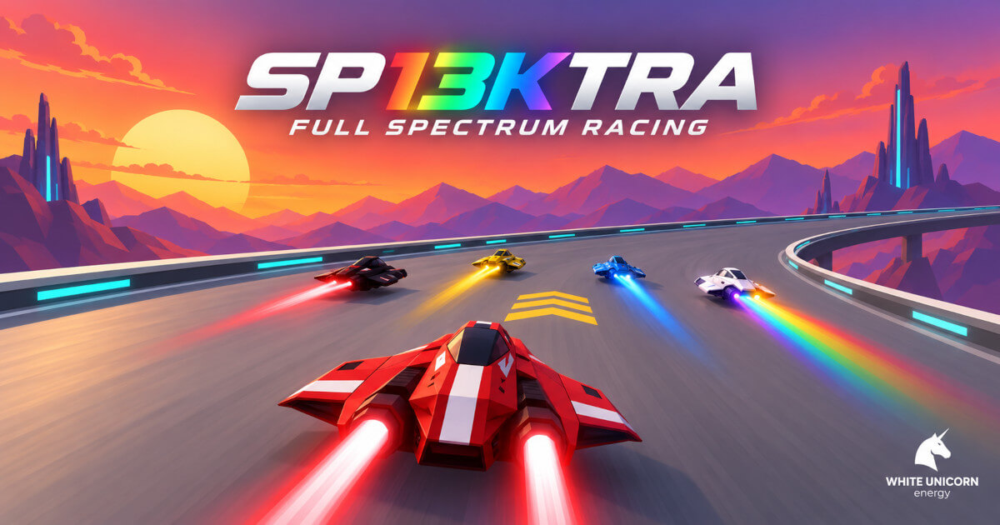
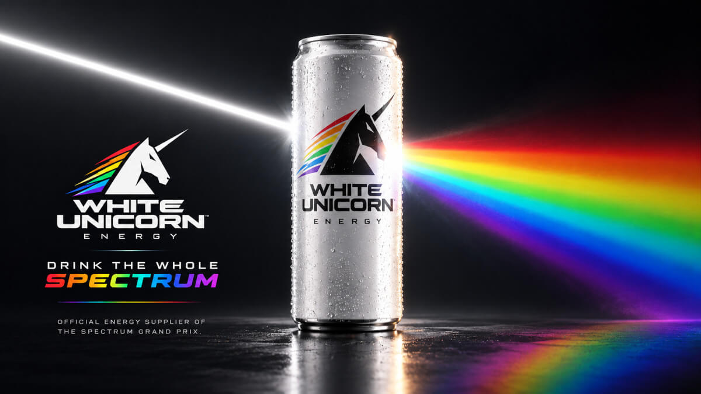

# 🦄🌈 SP13KTRA

*Full Spectrum Racing.*

Race eight anti-gravity craft across eight spectral circuits in real 3D. Every circuit has its own colour, theme, and procedural soundtrack.

Created by Frank Force for JS13k 2026

## 🕹️ Controls

- Accelerate = Mouse Left, Up or W
- Steer = Mouse, Left/Right or A/D
- Turbo = Mouse Right or Left Shift
- Brake = Mouse Middle or Space
- Music on/off = M

In the menu, click a circuit to pick it, click it again to race, and click TEAM to change craft.

## 🏁 How to Play

Finish a race to unlock the next circuit. Explode and you race it again.

- You have one energy meter: the turbo drains it, rainbow strips refill it, and walls and crashes cost it. At zero you explode.
- Yellow pads boost you. Pulsing arrows point around turns.
- White dashed shoulders are rough and slow you down, unless you turbo over them.
- Let go of the gas to turn harder.

## 🌈 Features

- Eight circuits and eight rival craft, one colour of the spectrum each.
- WebGL 3D rendering, lighting and fog, all generated from code.
- Procedural music, every circuit's techno loop is composed from a seed and baked on the fly.
- Canyons of towers, arch tunnels, banked bowls and a figure eight that crosses itself.
- Suns, eclipses, stars and clouds, with a different sky on every circuit.
- Boost pads, recharge strips, rough shoulders and rivals that race back.
- A live minimap of the real circuit with every racer on it.
- Your best placing and best time saved for every circuit.

