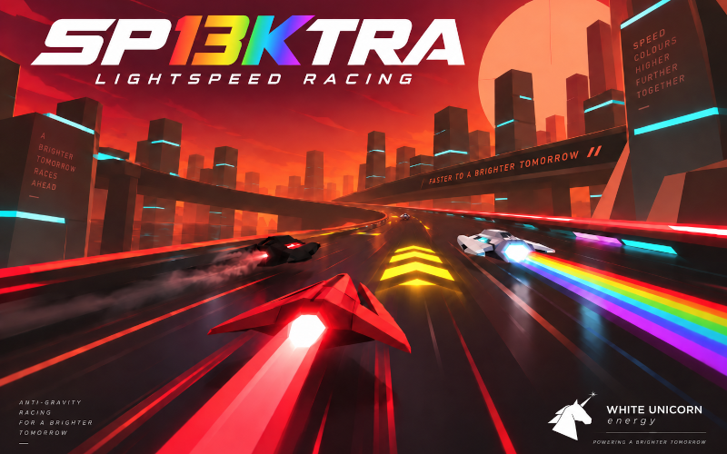

# SP13KTRA

*An anti-gravity grand prix in 13 kilobytes. Race the spectrum.*

Eight craft, ten circuits, three laps each, and one energy meter that is your
health, your boost fuel and your biggest decision. Made for js13kGames 2026 by
Frank Force.

**Play:** open `index.html`. No downloads, no server, no waiting.

## Controls

| Key | Action |
| --- | --- |
| Up | Accelerate |
| Left / Right | Steer |
| Down | Brake. Hold it with steer at speed to drift |
| Space (held) | Boost, spending energy |
| Mouse | Hold any button to steer: left drives, right brakes, middle boosts |
| R / M / Escape | Restart / mute / back to the title |
| Title | Left / Right browse circuits, Up / Down pick your colour, Space races |

## Energy

One meter, bottom left. Boost drains it, a clean drift refills it, and the
rainbow strip beside the start straight refills it fast. Walls and bumps cost
energy. Hit zero and you explode, then respawn at the last checkpoint with half
a tank.

## Drift

Tap the brake while steering at racing speed. The nose swings in, the steering
stays live and gas keeps the slide going. Hold it clean and your trail splits
into the spectrum, energy refills and a release burst charges. Let go for a kick.

## The championship

Finish on the podium to advance to the next circuit. Fourth or worse races it
again. Every circuit is browsable from the title. Yellow bands are boost pads,
the rainbow strip is recharge, glowing bands warn of a corner and the minimap
is the real circuit with every racer on it.

Ten circuits, one colour each: REDSHIFT, FILAMENT, SODIUM, AURORA, CHERENKOV,
RAYLEIGH, ULTRAVIOLET, UMBRA, ALBEDO and the finale, SP13KTRA.

> **WHITE UNICORN.** *Drink the whole spectrum.*
