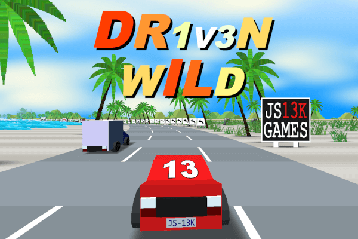

# SP13KTRA

*An anti-gravity grand prix in 13 kilobytes. Race the spectrum.*

> **This race programme is brought to you by WHITE UNICORN energy.**
> *Unsplit. Unbeaten. Undiluted light in a can.*
> Official energy supplier of the Spectrum Grand Prix.

Welcome to the Spectrum Grand Prix, driver. Eight craft, ten circuits, three laps
each, one energy meter that is your health, your boost fuel and your biggest
decision. Built for js13kGames 2026 by Frank Force: the whole game, worlds and all,
fits in a ZIP smaller than the screenshot below. The name is SPECTRA with the 13K
inside it, and on the title screen the 13K is the only thing in rainbow.

**Play:** open `index.html`. Keyboard only. No downloads, no server, no waiting.

## The field

White light is made of every colour. Split it and you get the grid.

| Craft | Who |
| --- | --- |
| **Red** | You. Fastest hue in the spectrum, slowest craft on the grid until you prove otherwise. |
| Orange, Yellow, Green, Blue, Violet | Five rivals, one pure hue each. Each has a home circuit where it drives a little harder. |
| **Black** | No light at all. The only craft whose trail hangs behind it like smoke. Strongest in the void of UMBRA. |
| **White** | The WHITE UNICORN works entry. Unsplit light, nearly perfect. Its trail is always the full spectrum. Nobody has beaten it on the finale. |

> *Fifth place? Sixth? The Unicorn doesn't know what those words mean.*
> **WHITE UNICORN.** *Drink the whole spectrum.*

## The race

- Eight craft start from a staggered grid. Your last finishing place sets your slot,
  so a rookie starts at the back.
- 3-2-1, then three laps with live standings. A lap takes about half a minute at
  racing pace.
- Finish on the podium and the championship moves you to the next circuit. Fourth
  or worse and you race the same circuit again. Podium on the finale and the
  season wraps back to the opener.
- All ten circuits are browsable from the title screen at any time. Advancement is
  just where the game remembers you were.
- Results show placement and total time. Your best time, circuit and last place are
  saved in the browser.

Records only count for laps driven the right way round through every gate. Respawns,
reversing over the line or cutting across another part of the circuit earn nothing.

## Controls

| Key | Action |
| --- | --- |
| Up | Accelerate |
| Left / Right | Steer |
| Down | Brake. Hold it with steer to drift |
| Space (held) | Boost, spending energy |
| R | Restart the race |
| M | Mute |
| Escape | Back to the title |
| Title: Left / Right | Browse circuits |
| Title: Up / Down | Pick your craft colour |
| Title: Space | Race |

Steering is immediate and grip is strong. Let go of the gas for gentle engine
braking, or hit Down for the real thing. Walls keep you on the road: hit one and you
lose outward speed and some energy, then slide along it and steer away. Riding a wall
is always slower than driving the corner.

## Energy

One meter, 100 points, bottom left. It is your health and your fuel.

| Event | Energy |
| --- | --- |
| Holding Space | -25 per second (a full meter is about four seconds of boost) |
| Clean drift | +4 per second after the first half second |
| Rainbow recharge strip | Rapid refill while you are on it |
| Craft bump | -6 |
| Hard wall hit | -10 |
| Scraping a wall | A slow drain, and drag |
| Zero | Explode, wait two seconds, respawn at the last checkpoint with 50 |

The recharge strip runs beside the start straight, one lane wide and off the fastest
line. Taking it is a choice. So is holding boost down the whole straight and arriving
at the hairpin with nothing left.

> *Running on empty at the last gate?*
> *Should have grabbed a WHITE UNICORN.* **Now in rainbow.** *Available only on the recharge strip.*

## Drift: splitting your own light

At racing speed, tap the brake while steering, or hold full lock at top speed. The
nose swings about 25 degrees inside your direction of travel, the turn-in stays
instant and the steering stays live. Gas keeps the slide going; centre the stick or
counter-steer to end it, and grip eases back so the exit never snaps you into a wall.

Hold a clean slide and three things happen:

1. Your trail widens and splits into the spectrum.
2. Energy starts refilling after half a second.
3. A release burst charges over about two seconds. Let go for a pad-strength kick.

Clean means fast, on the road and in control. Wall or craft contact and death
cancel the charge. Drifting is a tool for the corners that need it, not a
button to hold for the lap.

## Items

Rows of floating white prism stars hand you one item. The roll depends on your
position: leaders get defence, the back of the pack gets weapons. Rivals collect and
use the same items, against each other and against you. Your held item is the flat
glyph at the bottom of the screen, in the item's colour.

| Glyph | Item | What it does |
| --- | --- | --- |
| Yellow square | **Boost** | About 1.5 seconds of strong boost, free of energy |
| Magenta triangle | **Star bolt** | A homing shot at the next racer ahead |
| Magenta inverted triangle | **Glitter mine** | A hazard dropped on the road, live for about 30 seconds |
| Cyan circle | **Shield** | Absorbs one weapon hit |
| Magenta pentagon | **Prism storm** | Hits every racer ahead of you. Trailing positions only |

A weapon hit drains energy and spins you for about a second. Shields stop weapons,
not walls.

## Reading the road

Every signal means the same thing on every circuit.

- **Yellow bands** on the road are boost pads. They chain, one lane at a time, and
  push you past normal top speed.
- **The rainbow strip** is recharge.
- **White prisms** are items.
- **Magenta** is a weapon hazard.
- **Glowing bands on the outside of the road** warn of a corner.
- The **minimap** bottom right is the real circuit, with every racer on it.

## The ten circuits

Each circuit is one colour of the spectrum, in order, with its own skyline and one
landmark you will learn to steer by.

| # | Circuit | Colour | Character |
| --- | --- | --- | --- |
| 1 | REDSHIFT | Red | City opener: a wide oval, two long straights, two big banked 180s |
| 2 | FILAMENT | Orange | Crystal kidney: a corridor start into a tightening double apex |
| 3 | SODIUM | Yellow | Forest triangle with one waving flank |
| 4 | AURORA | Green | Broad S-course with two waving edges and an open bank |
| 5 | CHERENKOV | Cyan | A fully banked bowl around the shard, with a chicane opposite |
| 6 | RAYLEIGH | Blue | City figure-eight, the second crossing elevated over a corridor |
| 7 | ULTRAVIOLET | Violet | Angular crystal course ending in a hairpin the road narrows into |
| 8 | UMBRA | Near-black | Long, narrow void course, two hairpins, no ground at all |
| 9 | ALBEDO | White | Fast bright oval with a banked bowl and a chicane |
| 10 | SP13KTRA | Spectrum | Everything once, into a finale corridor lit in rainbow |

Difficulty comes from layout, width, banking and the rivals. Darkness and glare are
atmosphere, never the reason you could not see a corner.

> *Ten circuits. Seven rivals. One drink.*
> **WHITE UNICORN.** *See the whole spectrum. Then beat it.*

## Under the hood

For the js13k crowd who want to know what 13 kilobytes buys:

- **Real 3D, real movement.** WebGL, flat-shaded low-poly, no textures. Craft carry a
  world-space velocity; heading and travel direction can differ, and grip pulls them
  back together. Player and rivals run the same simulation.
- **Whole worlds built at load.** Each circuit is authored as a handful of corners
  with a radius, height and flags (wave, chicane, tunnel, crossing, banked). The game
  fillets that into a closed loop of 4,000 samples, about half a million units around,
  then lofts the road, walls, berms, markings, a ground plane, three bands of scenery,
  a landmark and the skyline. Two circuits cross over themselves.
- **Nothing is culled.** The road, the city, all eight craft, every item and every
  trail draw every frame. Static geometry lives on the GPU; only trails stream.
- **Eight-racer AI** that steers for lines, brakes for corners, hunts pads, avoids
  traffic and fires items, with a readable skill ladder and restrained catch-up that
  never moves a craft directly.
- **Ordered gates, sectors, laps, standings, a campaign and saves.**
- **A geometric sun, fog, a chase camera, a live minimap and a HUD** in one heavy
  typeface.
- **Synthesized sound** with ZZFX: engine pitch, boost, bumps, hits, zaps, pickups,
  the countdown and the lap chime.
- **13,312 bytes** is the limit. The build is Terser, Roadroller and a squeezed ZIP.

## Pit lane

Developers and the curious: `index.html` is the readable dev build and opens straight
from disk. Building and testing go through one serial runner so a single browser
runs at a time.

    npm i
    node test/safetest.js build          # fast build + size estimate
    node test/safetest.js build-full     # real Roadroller build, true ZIP size
    node test/safetest.js smoke loop circuits race items hover drift

[DESIGN.md](DESIGN.md) is what the game is meant to be. [CLAUDE.md](CLAUDE.md) is how
it works and how to build and test it. [SIZECODING.md](SIZECODING.md) is how it fits.

Created by Frank Force for js13kGames 2026, on a remixed Dr1v3n Wild engine.

> *WHITE UNICORN is not responsible for wall contact, prism storms or fourth place.*
